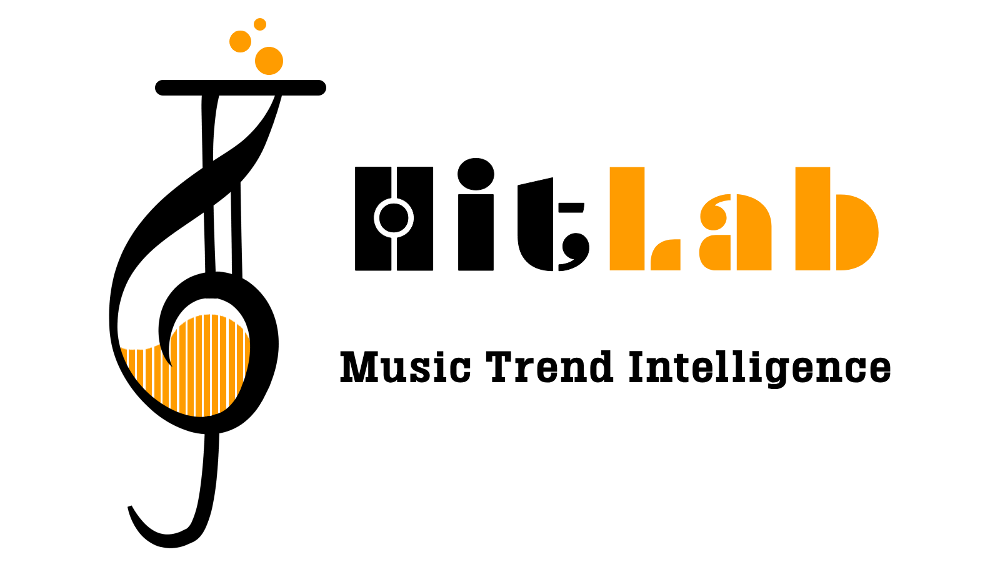

<p align="center">
  
</p>

<p align="center">
  <strong>Real-time music trend intelligence across 10 markets</strong>
</p>

<p align="center">
  <a href="https://hitlab.streamlit.app">
    
  </a>
</p>

---

HitLab is an end-to-end data pipeline that ingests music trends across 10 countries every 30 minutes, computes a proprietary **hype score**, and surfaces emerging tracks before they blow up.

---

## Architecture

```
Last.fm API ──┐
Deezer API  ──┼──▶  Go ingestion  ──▶  Neon (PostgreSQL)  ──▶  Streamlit dashboard
iTunes API  ──┘    (goroutines +        (time-series)           (live · hosted)
                    worker pool)
```

> **Deployed stack** — GitHub Actions runs the pipeline every 30 min, writes to Neon, dashboard served on Streamlit Cloud.

> **Local stack** — full Docker Compose setup with Kafka + TimescaleDB.

---

## The Formula

```python
hype_score = (
    reach         * 0.30 +   # log-scaled listeners (Last.fm)
    geo_spread    * 0.25 +   # number of countries trending
    deezer_rank   * 0.25 +   # streaming popularity (Deezer)
    velocity      * 0.20     # Δ reach over time
) * 100
```

---

## Stack

| Layer | Technology | Role |
|---|---|---|
| **Ingestion** | Go · goroutines · worker pool | Parallel fetch from Last.fm + enrichment via Deezer & iTunes |
| **Transport** | Apache Kafka *(local)* | Event streaming between ingestion and transform |
| **Transform** | Python | Hype score computation, batch writes |
| **Storage** | PostgreSQL · TimescaleDB *(local)* · Neon *(hosted)* | Time-series track events |
| **Dashboard** | Streamlit · Plotly | Live rankings, momentum charts, regional heatmaps |
| **CI/CD** | GitHub Actions | Pipeline runs every 30 min, no server needed |

---

## Run locally

```bash
git clone https://github.com/YAWTUUYAS/HitLab
cd HitLab

cp .env.example .env
# add your LASTFM_API_KEY

./run.sh   # starts Kafka + TimescaleDB + ingestion + dashboard
# → http://localhost:8501
```

---

## Project structure

```
HitLab/
├── ingestion/          # Go — fetch · enrich · publish
│   ├── main.go
│   ├── lastfm/
│   ├── deezer/
│   ├── itunes/
│   └── track/
├── transform/          # Python — hype score · DB write
│   └── consumer.py
├── dashboard/          # Streamlit app
│   ├── app.py
│   └── lib/
├── .github/workflows/  # GitHub Actions pipeline
├── docker-compose.yml
└── schema.sql
```

---

*Formula v0.1 · 10 markets · Updates every 30 min*
